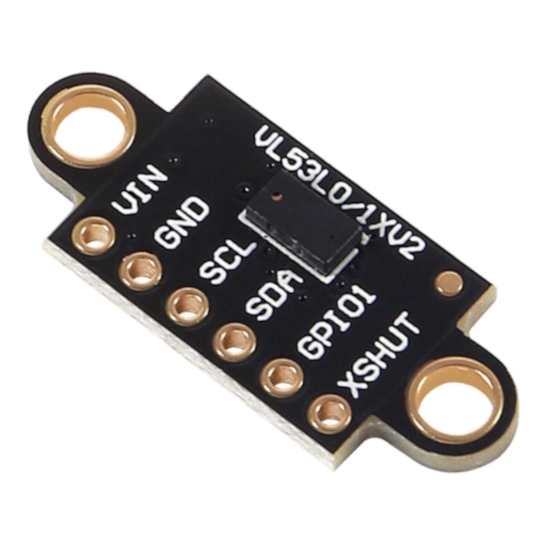
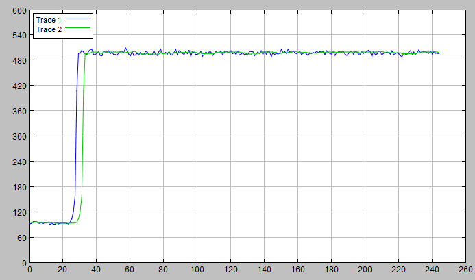

# STM32H7_VL53L0X

# Алгоритм работы датчика Лазерный дальномер GY-530 VL53L0X

Работа с [VL53L0X](https://www.st.com/en/imaging-and-photonics-solutions/vl53l0x.html#documentation) делится на 2 этапа: инициализация датчика и считывание измеренного значения расстояния. Рассмотрим в подробностях алгоритм взаимодействия датчика и микроконтроллера.
Датчик имеет 3 линии передачи данных (2 - I2C (SDA, SCL), 1 - Interrupt (GPIO1)). Основная коммуникация происходит по линиям I2C.

## Подход к проектированию ПО

В первую очередь требуется определить подход к проектированию ПО. Было определено 3 основных подхода: собственная реализация библиотеки, применение [сторонней библиотеки](https://github.com/Squieler/VL53L0X---STM32-HAL/tree/main), применение [API от ST](https://www.st.com/resource/en/user_manual/um2039-world-smallest-timeofflight-ranging-and-gesture-detection-sensor-application-programming-interface-stmicroelectronics.pdf). В случае 2-х последних подходов разработчикам надо будет применять только лишь функции, определенные в библиотеке/API. Этот подход значительно сократит время разработки и количество ошибок во время разработки, при этом не сильно уменьшает понимание разработчиков принципа функционирования VL53L0X. В случае собственной реализации будет реализовываться схожая со сторонней библиотекой собственная библиотека.

## 1. Инициализация

В процессе инициализации по I2C в регистры датчика передается конфигурационная информация. Кадры I2C обеспечит библиотека HAL.

**VL53L0X_DataInit()**: После сброса системы необходимо произвести настройку данных (Настройка интерфейсов, питания и тп.) *Выполняется только 1 раз после RESET*.

**VL53L0X_StaticInit()**: Выполняется после запуска или после VL53L0X_DataInit(). Выполните базовую инициализацию устройства. На этом этапе будут применены все настройки по умолчанию.

После базовой инициализации возможно провести 3 вида калибровки: *Reference SPADs calibration*, *Offset calibration* и *Ref (temperature) calibration*. В [user manual](https://www.st.com/resource/en/user_manual/um2039-world-smallest-timeofflight-ranging-and-gesture-detection-sensor-application-programming-interface-stmicroelectronics.pdf) утверждается, что проводить *Reference SPADs calibration* и *Offset calibration* не обязательно, тк калибровка уже была проведена на производстве ST. *Ref (temperature) calibration* проводится записью в регистр управляющих команд и ожидании ответа на них.

Далее выставляется **Device mode**.
- Single Ranging
- Continuous Ranging
- Continuous Timed Ranging

В конце инициализации требуется выбрать режим выдачи иформации:
- interrupt
- polling

*Дополнительная возможность* - управление пределами. ~~Добавить описание перделов~~
*Дополнительная возможность* - управление временем обработки. ~~Добавить описание времени обработки~~
## 2. Считывание значения

В зависимости от требований по частоте обновления данных будет выбран 2 или 3 режим работы и один из режимов выдачи информации.  
Фильтрация данных происходит с помощью медианного фильтра на 10 значений.  
  
*Trace 1 - неотфильтрованные данные, которые при получении сразу отправляются в терминал.*  
*Trace 2 - отфильтрованные данные. После фильтра отправляются в терминал.*  
На графике показано наглядно влияние фильтра на шумы, вносимые помехами и неточностью прибора.
> При увеличении элементов фильтра, так же увеличивается задержка, которую по хорошему нужно минимизировать. Именно поэтому выбран компромисс с 10-ю значениями.  

[Заготовка технического описания](technical_desc.md)

[Заготовка программного описания](program_desc.md)
