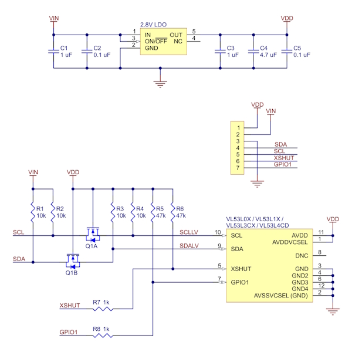

## Техническое описание дальномера VL53L0X

### 1. Элементная база
Модуль/Микросхема
**VL53L0X** - время-пролётный (ToF) лазерный дальномер производства STMicroelectronics.

### Основные характеристики

<table>
  <thead>
    <tr>
      <th>Параметр</th>
      <th>Значение/Описание</th>
    </tr>
  </thead>
  <tbody>
    <tr>
      <td><strong>Тип датчика</strong></td>
      <td>Лазерный дальномер время-пролётного типа (ToF)</td>
    </tr>
    <tr>
      <td><strong>Излучатель</strong></td>
      <td>Лазерный диод VCSEL класса 1 (безопасен для глаз)</td>
    </tr>
    <tr>
      <td><strong>Длина волны</strong></td>
      <td>940 нм (инфракрасный)</td>
    </tr>
    <tr>
      <td><strong>Диапазон измерений</strong></td>
      <td>До 2 метров (типично 1-1.2 м с высокой точностью)</td>
    </tr>
    <tr>
      <td><strong>Точность</strong></td>
      <td>±3% от измеряемого расстояния</td>
    </tr>
    <tr>
      <td><strong>Разрешение</strong></td>
      <td>1 мм</td>
    </tr>
    <tr>
      <td><strong>Поле обзора (FOV)</strong></td>
      <td>25°</td>
    </tr>
    <tr>
      <td><strong>Интерфейс связи</strong></td>
      <td>I2C (до 400 кГц)</td>
    </tr>
    <tr>
      <td><strong>Адрес I2C</strong></td>
      <td>0x52 по умолчанию</td>
    </tr>
    <tr>
      <td><strong>Напряжение питания</strong></td>
      <td>2.6V - 3.5V (номинальное 3.3V)</td>
    </tr>
    <tr>
      <td><strong>Потребление тока</strong></td>
      <td>&lt;20 мА в активном режиме</td>
    </tr>
    <tr>
      <td><strong>Размеры</strong></td>
      <td>4.4 × 2.4 × 1.0 мм (корпус)</td>
    </tr>
  </tbody>
</table>

### Ключевые особенности

- Встроенный DSP для обработки сигнала
- Автоматическая калибровка
- Корректировка межсимвольной помехи (crosstalk)
- Защита от помеховых отражений
- Компенсация температурного дрейфа

## 2. Схема подключения

Типовая схема подключения к микроконтроллеру

```
VL53L0X (Модуль)              Микроконтроллер (STM32)
┌─────────────────┐          ┌─────────────────────┐
│                 │          │                     │
│   VIN (3.3V)────┼──────────┼────► 3.3V           │
│                 │          │                     │
│   GND ──────────┼──────────┼────► GND            │
│                 │          │                     │
│   SCL ──────────┼──────────┼────► PX1Y1(I2C2_SCL)│
│                 │          │                     │
│   SDA ──────────┼──────────┼────► PX2Y2(I2C2_SDA)│
│                 │          │                     │
│   XSHUT ────────┼──────────┼────► PX3Y3  (GPIO)  │
│                 │          │                     │
│   GPIO1 ────────┤          │                     │
└─────────────────┘          └─────────────────────┘
```

### Описание выводов

<table>
  <thead>
    <tr>
      <th>Вывод VL53L0X</th>
      <th>Назначение</th>
      <th>Описание</th>
    </tr>
  </thead>
  <tbody>
    <tr>
      <td><strong>VIN</strong></td>
      <td>Питание</td>
      <td>2.6-3.5V DC (рекомендуется 3.3V)</td>
    </tr>
    <tr>
      <td><strong>GND</strong></td>
      <td>Земля</td>
      <td>Общий провод</td>
    </tr>
    <tr>
      <td><strong>SCL</strong></td>
      <td>I2C Clock</td>
      <td>Тактовый сигнал интерфейса I2C</td>
    </tr>
    <tr>
      <td><strong>SDA</strong></td>
      <td>I2C Data</td>
      <td>Данные интерфейса I2C</td>
    </tr>
    <tr>
      <td><strong>XSHUT</strong></td>
      <td>Hardware Shutdown</td>
      <td>Низкий уровень - отключение, высокий - включение</td>
    </tr>
    <tr>
      <td><strong>GPIO1</strong></td>
      <td>General Purpose I/O</td>
      <td>Может использоваться как прерывание</td>
    </tr>
  </tbody>
</table>


### Требования к обвязке

- Конденсаторы питания: 1 μF и 100 nF рядом с модулем
- Подтяжка I2C: Резисторы 10 кОм на линии SCL и SDA к 3.3V
- XSHUT: При отсутствии управления можно подключить к 3.3V

### Схема включения модуля



## 3. Принцип функционирования

Технология Time-of-Flight (ToF)
- Излучение импульса: Лазерный диод излучает короткий импульс ИК-света
- Отражение: Свет отражается от объекта и возвращается к датчику
- Прием: Фотодиод улавливает отраженный сигнал
- Измерение времени: Встроенный таймер измеряет время между излучением и приемом
- Расчет расстояния: Расстояние = (скорость света × время пролета) / 2

### Режимы работы

- Одиночное измерение: Одноразовое измерение по команде
- Непрерывное измерение: Периодические измерения с заданной частотой
    - Режим высокой точности: Большее время измерения для повышения точности
    - Режим высокой скорости: Быстрые измерения с меньшей точностью

## 4. Программный интерфейс

Протокол связи **I2C**

- Скорость: До 400 кГц (стандартный режим)
- Адрес: 0x52 (7-битный)

## 5. Особенности применения

- Преимущества
    - Высокая точность на коротких расстояниях
    - Независимость от цвета и текстуры объекта
    - Низкая чувствительность к внешнему освещению
    - Компактные размеры
    - Простой цифровой интерфейс

- Ограничения и рекомендации
    - Прозрачные объекты: Могут быть обнаружены неправильно
    - Высокий коэффициент отражения: Может вызывать насыщение
    - Прямой солнечный свет: Может снижать точность
    - Угол наклона: Рекомендуется угол < 10° к нормали объекта
    - Калибровка: Требуется начальная калибровка для оптимальной работы


## 6. Эксплуатационные характеристики

### Температурный режим

- Рабочая температура: -20°C до +70°C
- Температура хранения: -40°C до +85°C
- Температурная компенсация: Встроенная

Монтаж: Поверхностный монтаж (SMD)

Защита: Встроенная защита от ESD

